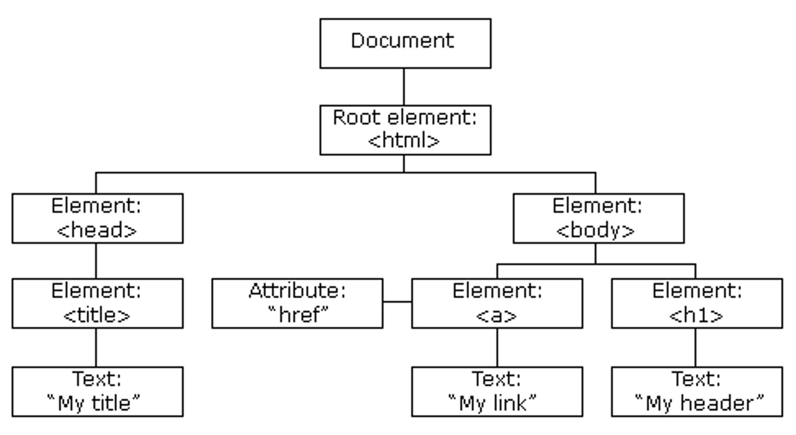
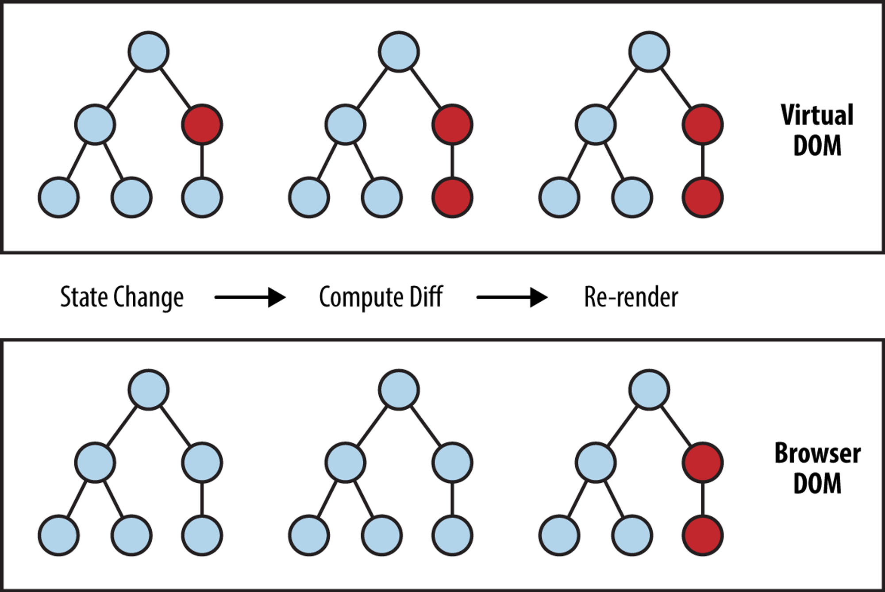
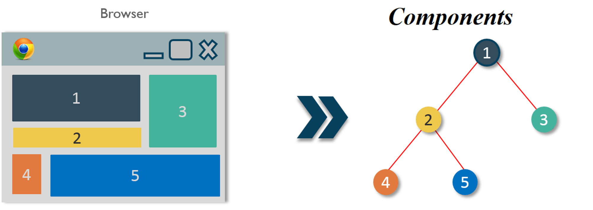
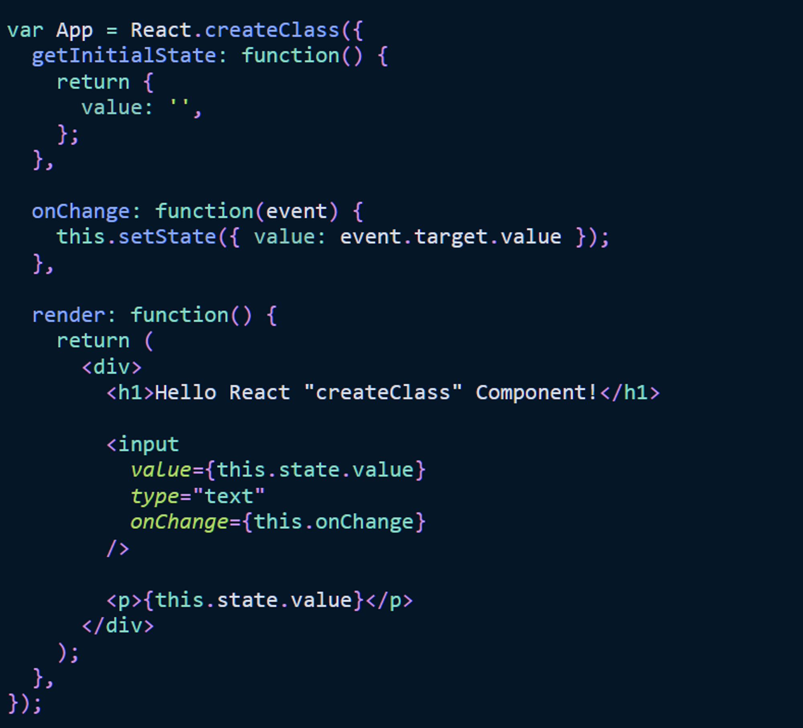
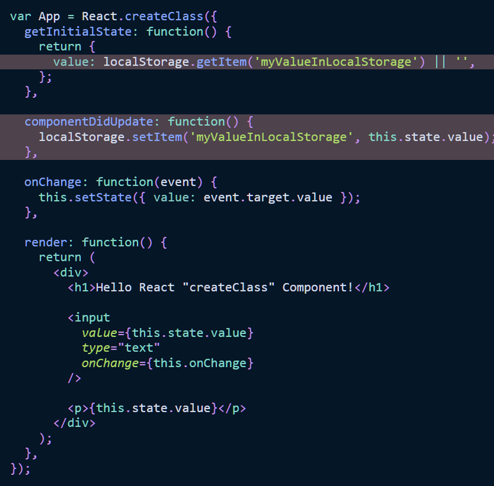

# #1: Introduction To React
**React** is a library developed by Facebook, and released in 2013. It is a JavaScript library used to build interactions with components on a website. One of the most prominent features of React is the ability to render data not only on the server side but also on the client side.


Before React, developers often encountered difficulties using vanilla JavaScript and JQuery to build user interfaces. This meant that the application development process would be longer and more prone to errors and risks. Therefore, in 2011, React was introduced with the main purpose of improving the UI development process.

Furthermore, to speed up the development process and minimize potential risks while coding, React provides us with the ability to reuse code through two important concepts:

# Real DOM & Virtual DOM
## **Real DOM**

Firstly, when we talk about the Real DOM, DOM stands for "Document Object Model," which simply represents the interface of your application. Whenever there is a change in the state of your application's user interface, the DOM is updated to reflect that change. Now, frequent manipulation of the DOM can impact performance, making it slow.



The slowness here refers to the layout that browsers have to perform whenever the DOM changes. Every time the DOM changes, the browser needs to recalculate CSS and rebuild the web page. This process takes time.

## ****Virtual DOM****

The concept of Virtual DOM has emerged as a significantly better alternative to the actual DOM. The Virtual DOM is simply a virtual representation of the DOM. Whenever the state of our application changes, the Virtual DOM gets updated instead of the Real DOM.

### Virtual DOM Working

When new elements are added to the user interface, a Virtual DOM, represented as a tree, is created. Each element becomes a node on this tree. If the state of any of these elements changes, a new Virtual DOM tree is created. This tree is then compared or "diffed" with the previous Virtual DOM tree.

Once this is done, the Virtual DOM calculates the most efficient way to make these changes to the Real DOM. This ensures minimal update operations on the Real DOM, reducing the performance overhead of updating the Real DOM.



The red circles represent the changed nodes. These nodes represent the user interface elements that have changed in state. The difference between the previous version of the Virtual DOM tree and the current one is then calculated. Then, the entire main subtree is re-rendered to provide an updated user interface. This updated tree is then batch updated to the Real DOM.

With such targeted updates, it saves us a lot of resources and processing time. In large and complex websites like e-commerce, food ordering, etc., this becomes essential and crucial to enhance customer experience and significantly improve performance.

## ****React sử dụng Virutal DOM thế nào****

In React, each user interface component is a separate entity, and each component has one or more states. React follows the observable pattern, where it can observe and listen for state changes. When one of the component's states changes, React updates the Virtual DOM. After the Virtual DOM is updated, React compares the current version of the Virtual DOM with the previous version. This process is known as the "Diffing" algorithm.

When React identifies which Virtual DOM objects have changed, it proceeds to update only those specific objects in the Real DOM. This makes the process much more efficient compared to directly manipulating the Real DOM, making React stand out as a high-performance JavaScript library.

# Components and JSX
**Components** are independent and reusable user interface (UI) elements that are defined separately and completely separate from each other.

We can think of components as functions in JavaScript. They take any inputs (or "props") and return React elements that represent what is displayed on the browser. Using and breaking down components helps make programming more efficient and helps build a better application.



# **Types of React Components**

## [React create class component](https://codesandbox.io/s/vi-du-ve-react-them-sua-xoa-3yvkt?file=/src/Excel.js:111-116)

In JavaScript, before the class syntax was introduced in ES6, creating components in React was done using the createClass method. This method allows developers to create components without explicitly using JavaScript classes.

The createClass method is a function provided by React. It takes an object as an argument, defining the behavior of the component by specifying different methods and properties.



The createClass() method takes an object that defines the methods for the component. While the getInitialState() function is used to set the initial state of the component, the mandatory render() method is used to display the output with JSX. Additional "methods" (e.g., onChange()) can be added by passing additional functions to the object.



In the example above, we define the componentDidUpdate() method. When the component is updated, React automatically calls this method. You can perform actions after each update in this method. In the example, we store the value from the component's state to local storage after each update.

Note: The createClass method of React is no longer available in the React core package. If you want to use it, you need to install an additional node package: npm install create-react-class.

However, you should only use React's createClass method if your project does not have JavaScript ES6 or newer versions available. If possible, you should avoid using it. You can read more about[React's createClass Components over here.](https://reactjs.org/docs/react-without-es6.html)

### **React Mixins**

React Mixins is a design pattern in React that allows for reusing component logic. It enables you to separate logic from a component and place it in an independent object called a Mixin. You can then use this Mixin in multiple different components to share that logic.

When using a Mixin in a component, all the features and methods defined in the Mixin will be applied to that component. This allows you to easily and flexibly reuse the logic from the Mixin across different components.

```tsx
var APIMixin = {
  fetchData: function(url) {
    return fetch(url)
      .then(response => response.json())
      .catch(error => {
        console.error('Error fetching data:', error);
      });
  }
};

var DataComponent = React.createClass({
  mixins: [APIMixin],

  componentDidMount: function() {
    this.fetchData('https://api.example.com/data')
      .then(data => {
        // handle data
      });
  },

  render: function() {
    return <div>Loading data...</div>;
  }
});

var DisplayComponent = React.createClass({
  mixins: [APIMixin],

  componentDidMount: function() {
    this.fetchData('https://api.example.com/data')
      .then(data => {
        // handle data
      });
  },

  render: function() {
    return <div>Displaying data...</div>;
  }
});

ReactDOM.render(
  <div>
    <DataComponent />
    <DisplayComponent />
  </div>,
  document.getElementById('root')
);
```

In the example above, we have a Mixin called APIMixin, which contains the fetchData() method to send requests and receive data from an API.

Next, we create two components: DataComponent and DisplayComponent. Both of them use the APIMixin by adding it to the mixins array.

In the componentDidMount() method, both components call the fetchData() method from the Mixin to send a request for fetching data from the API. After receiving the data, we can process and display it on the interface for each component.

By using Mixins, we share the fetchData() logic between two different components easily. This helps reduce code duplication and increases the reusability of the data processing logic from the API.

However, as mentioned earlier, Mixins are no longer encouraged to be used in modern React. Consider using patterns like component composition or higher-order components to safely and flexibly reuse component logic.

- [Mô hình component composition](https://felixgerschau.com/react-component-composition/#:~:text=Component%20composition%20is%20the%20name,new%20components%20with%20other%20components.): Allows you to reuse the logic and functionality of components by combining (composing) them together
    
    ```tsx
    // component con chứa logic xử lý form
    var FormLogicComponent = ({ validateForm }) => {
      const handleSubmit = (event) => {
        event.preventDefault();
        var email = event.target.email.value;
        var password = event.target.password.value;
    
        if (validateForm(email, password)) {
          console.log('Đăng ký thành công!');
        } else {
    			console.log('Vui lòng kiểm tra lại thông tin đăng ký!');
        }
      };
    
      return (
        <form onSubmit={handleSubmit}>
          <input type="text" name="email" placeholder="Email" />
          <input type="password" name="password" placeholder="Mật khẩu" />
          <button type="submit">Đăng ký</button>
        </form>
      );
    };
    
  
    var ValidationComponent = ({ children }) => {
      const validateEmail = (email) => {
        return /\S+@\S+\.\S+/.test(email);
      };
    
      const validatePassword = (password) => {
        return password.length >= 6;
      };
    
      const validateForm = (email, password) => {
        return validateEmail(email) && validatePassword(password);
      };
    
  
      const formComponent = React.Children.map(children, (child) => {
        return React.cloneElement(child, { validateForm });
      });
    
      return (
        <div>
          {formComponent}
        </div>
      );
    };
    
   
    var App = () => {
      return (
        <ValidationComponent>
          <FormLogicComponent />
        </ValidationComponent>
      );
    };
    
    ReactDOM.render(
      <App />,
      document.getElementById('root')
    );
    ```
    
    By using the component composition model, we can share logic between components in a flexible manner and reuse it in different scenarios.

    The component composition model is a powerful way to build reusable components and create clear separation between the distinct logics of an application.
    
- High order components

## React class components

React Class Components were introduced in JavaScript ES6. Prior to that, in JavaScript ES5, there was no built-in class syntax, so React provided the createClass method to create components.

However, starting from JavaScript ES6, classes were added to the JavaScript language, allowing us to directly create class-based components without using React's createClass method.


A React Class Component is written using JavaScript classes and comes with methods such as the constructor - a primary method used in React for initializing the initial state or binding methods - and the required render method that returns JSX as the final output to be displayed in the browser.

In a class component, we inherit from the React.Component class to have the methods and features provided by React. We can use lifecycle methods such as componentDidMount, componentDidUpdate, componentWillUnmount to perform actions corresponding to the component's lifecycle stages.


React Class Components provide several lifecycle methods for component mounting, updating, and unmounting. In the previous example of local storage, we can use lifecycle methods to perform side effects - like saving the latest input value to local storage - and in the constructor function to set the initial state from local storage.

```tsx
class MyComponent extends React.Component {
  constructor(props) {
    super(props);
    this.state = {
      value: localStorage.getItem("myValue") || ""
    };
  }

  componentDidMount() {
    // This method is called after the component is mounted
    // We can use it to read the value from the local storage
    const storedValue = localStorage.getItem("myValue");
    if (storedValue) {
      this.setState({ value: storedValue });
    }
  }

  componentDidUpdate() {
    // This method is called after the component is updated
    // We can use it to save the latest value to the local storage
    localStorage.setItem("myValue", this.state.value);
  }

  handleChange(event) {
    this.setState({ value: event.target.value });
  }

  render() {
    return (
      <div>
        <input
          type="text"
          value={this.state.value}
          onChange={this.handleChange.bind(this)}
        />
      </div>
    );
  }
}
```

In the above example, we use the componentDidMount method to retrieve the value from local storage when the component is mounted, and we use the componentDidUpdate method to save the latest input value to local storage after each component update.

By utilizing these lifecycle methods, we can perform side effects related to local storage and update the component's state in a flexible and automatic manner. 

## React Function Component

React Function Components are a way to create components using functions instead of classes, as in React Class Components. This makes writing and managing code easier and allows for the use of new features like React Hooks.

React Hooks are a set of functions provided by React that allow us to use state and side-effects in React Function Components.

```tsx
import React, { useState, useEffect } from 'react';

function UserList() {
  const [users, setUsers] = useState([]);
  const [isLoading, setIsLoading] = useState(false);
  const [error, setError] = useState(null);

  useEffect(() => {
    fetchUsers();
  }, []);

  const fetchUsers = () => {
    setIsLoading(true);

    axios.get('https://api.example.com/users')
      .then(response => {
        setUsers(response.data);
        setIsLoading(false);
      })
      .catch(error => {
        setError(error.message);
        setIsLoading(false);
      });
  };

  if (isLoading) {
    return <div>Loading...</div>;
  }

  if (error) {
    return <div>Error: {error}</div>;
  }

  return (
    <div>
      <h1>User List</h1>
      <ul>
        {users.map(user => (
          <li key={user.id}>{user.name}</li>
        ))}
      </ul>
    </div>
  );
}

export default UserList;
```

- useState: This is a hook that allows us to declare and use state in Function Components. We can declare state using the syntax [state, setState] = useState(initialState), where state is the initial state value, and setState is a function to update the state value.

- useEffect: This is a hook that allows us to perform side-effects in Function Components. We can use useEffect to call functions when components are mounted, updated, or unmounted. This enables us to perform tasks like making API calls, subscribing to events, or manipulating the DOM.

By combining React Function Components and React Hooks, we can write components more easily and use state and side-effects in the same place. This enhances creativity and efficiency in building React applications.

# [JSX](https://legacy.reactjs.org/docs/jsx-in-depth.html)

 JSX (JavaScript XML) allows you to write HTML-like code in JavaScript files in an easier and more structured way, and then React compiles it into JavaScript code.

```jsx
<div class="title">This is first JSX Element!</div>
```

And React will compile it into JavaScript code like this

```jsx
React.createElement(
  "div",
  {className: "title"},
  "Welcome to VoManhKien.com"
};
```

If you want to see how specific JSX is transformed into JavaScript, you can try the [Babel compiler](https://babeljs.io/repl/#?presets=react&code_lz=GYVwdgxgLglg9mABACwKYBt1wBQEpEDeAUIogE6pQhlIA8AJjAG4B8AEhlogO5xnr0AhLQD0jVgG4iAXyJA).