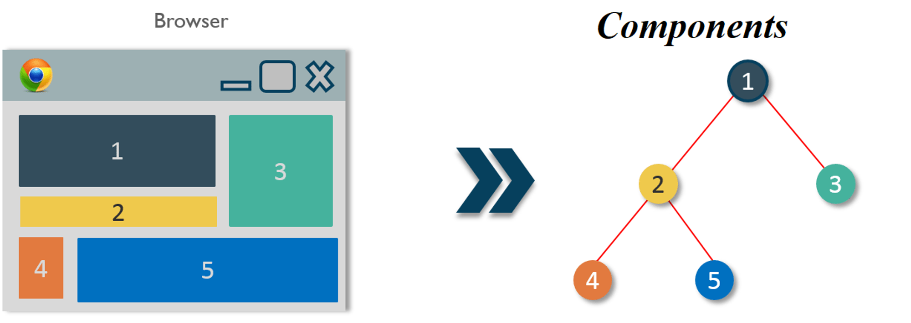
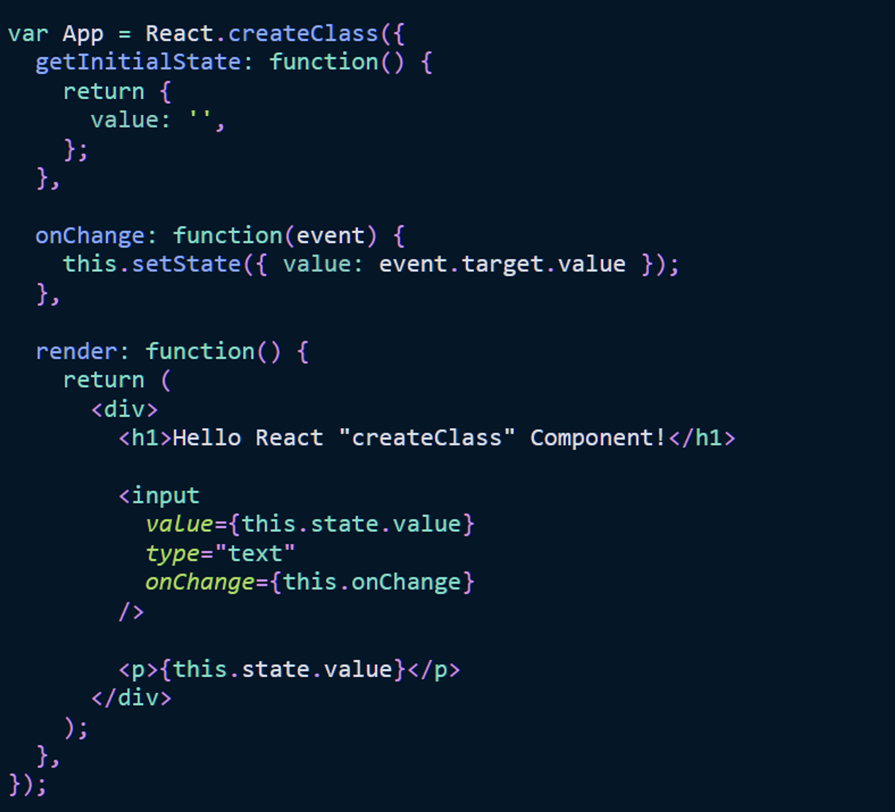

# #1: Introduction To React
**React** là một library được phát triển bởi Facebook, ra mắt vào năm 2013, bản thân nó là một thư viện Javascript được dùng để để xây dựng các tương tác với các thành phần trên website. Một trong những điểm nổi bật nhất của React đó là việc render dữ liệu không chỉ thực hiện được trên tầng Server mà còn ở dưới Client


Trước khi có React, lập trình viên thường gặp rất nhiều khó khăn trong việc sử dụng vanilla JavaScript và JQuery để xây dựng UI. Điều đó đồng nghĩa với việc quá trình phát triển ứng dụng sẽ lâu hơn và xuất hiện nhiều lỗi, rủi ro hơn. Vì vậy vào năm 2011, React ra đời với mục đích chính là cải thiện quá trình phát triển UI.

Hơn nữa, để tăng tốc quá trình phát triển và giảm thiểu những rủi ro có thể xảy ra trong khi coding, React còn cung cấp cho chúng ta khả năng **Reusable Code** (tái sử dụng ****code**)** bằng cách đưa ra 2 khái niệm quan trọng bao gồm:

# Real DOM & Virtual DOM
## **Real DOM**

Thứ đầu tiên khi chúng ta nói về Real DOM. DOM có nghĩa là “Document Object Model”, nói đơn giản hơn nó đại diện cho giao diện của ứng dụng của bạn. Mỗi khi có sự thay đổi về trạng thái của giao diện người dùng ứng dụng của bạn, DOM sẽ được cập nhật để thể hiện sự thay đổi đó. Bây giờ việc bắt thường xuyên thao tác DOM sẽ ảnh hưởng đến hiệu suất, khiến nó trở nên chậm chạp.


Điều chậm ở đây là layout mà các trình duyệt phải làm bất cứ khi nào DOM thay đổi. Mỗi khi DOM thay đổi, trình duyệt cần phải tính toán lại CSS, thực hiện dựng lại trang web. Đây là việc cần có thời gian.

## ****Virtual DOM****

Khái niệm Virtual DOM xuất hiện và hoạt động tốt hơn đáng kể so với DOM thực. Virtual DOM chỉ là một đại diện ảo của DOM. Mỗi khi trạng thái ứng dụng của chúng tôi thay đổi, Virtual DOM sẽ được cập nhật thay vì Real DOM.

### Virtual DOM Working

Khi các phần tử mới được thêm vào giao diện người dùng, một Virtual DOM, được biểu thị dưới dạng cây sẽ được tạo. Mỗi phần tử là một nút trên cây này. Nếu trạng thái của bất kỳ phần tử nào trong số này thay đổi, một cây Virtual DOM mới sẽ được tạo. Cây này sau đó được so sánh hoặc "khác biệt" với cây Virtual DOM trước đó.

Khi điều này được thực hiện, Virtual DOM sẽ tính toán phương pháp tốt nhất có thể để thực hiện những thay đổi này đối với Real DOM. Điều này đảm bảo tối thiểu hoạt động cập nhật trên Real DOM. Do đó, giảm hao tốn hiệu suất của việc cập nhật Real DOM.


Các vòng tròn màu đỏ đại diện cho các nút đã thay đổi. Các nút này đại diện cho các phần tử giao diện người dùng đã bị thay đổi trạng thái. Sau đó sẽ tính toán sự khác biệt giữa phiên bản trước của cây Virtual DOM so với hiện tại. Sau đó, toàn bộ cây con chính sẽ được hiển thị lại để cung cấp giao diện người dùng được cập nhật. Cây cập nhật này sau đó được cập nhật hàng loạt vào Real DOM.

Với việc cập nhật đúng chỗ như vậy, khỏi phải nói nó tiết kiệm cho chúng ta rất nhiều tài nguyên cũng như thời gian xử lý. Ở các website lớn và phức tạp như thương mại điện tử, đặt món ăn, v.v bạn sẽ thấy việc này là vô cùng cần thiết và quan trọng để làm tăng trải trải nghiệm của khách hàng và performance được cải thiện đáng kể.

## ****React sử dụng Virutal DOM thế nào****

Trong React, mỗi phần giao diện người dùng là một thành phần, và mỗi thành phần có một hoặc nhiều trạng thái. React tuân theo mô hình có thể quan sát được và lắng nghe các thay đổi trạng thái **(observable pattern)**. Khi một trong các trạng thái của phần giao diện thay đổi, React cập nhật Virtual DOM. Sau khi Virtual DOM đã được cập nhật, React sẽ so sánh phiên bản Virtual DOM hiện tại với phiên bản trước đó. Quá trình này được gọi là thuật toán `Diffing`

Khi React biết các đối tượng Virtual DOM nào đã thay đổi, sẽ tiến hành cập nhật duy nhất đối tượng đó vào Real DOM. Điều này làm cho hiệu xuất nhanh hơn đáng kể khi so sánh với thao tác trực tiếp với Real DOM, làm cho React nổi bật như một thư viện JavaScript hiệu suất cao.

# Components and JSX
**Components** là những thành phần giao diện (UI) được định nghĩa độc lập, có thể tái sử sụng và hoàn toàn tách biệt nhau.

Chúng ta có thể hiểu component là một hàm trong javascript. Chúng nhận bất kỳ đầu vào nào (hay còn gọi là “*props*“) và trả về các React elements thể hiện những gì được hiển thị trên trình duyệt.  Việc sử dụng và chia nhỏ component giúp các việc lập trình trở nên hiệu quả và giúp xây dựng một application tốt hơn.



# **Types of React Components**

## [React create class component](https://codesandbox.io/s/vi-du-ve-react-them-sua-xoa-3yvkt?file=/src/Excel.js:111-116)

Trong JavaScript, trước khi cú pháp lớp (class) được giới thiệu trong ES6, việc tạo các thành phần (components) trong React được thực hiện bằng cách sử dụng phương thức **`createClass`**. Phương thức này cho phép nhà phát triển tạo ra các components mà không cần sử dụng lớp JavaScript một cách rõ ràng.

Phương thức **`createClass`** là một hàm được cung cấp bởi React. Nó chấp nhận một đối tượng làm đối số, định nghĩa hành vi của component bằng cách chỉ định các phương thức và thuộc tính khác nhau.



Phương thức createClass() nhận vào một đối tượng mà trong đó định nghĩa các phương thức cho component. Trong khi hàm getInitialState() được sử dụng để đặt trạng thái ban đầu cho component, phương thức bắt buộc render() được sử dụng để hiển thị đầu ra với JSX. Các "phương thức" bổ sung (ví dụ: onChange()) được thêm vào bằng cách truyền thêm các hàm vào đối tượng.


Trong ví dụ trên, chúng ta định nghĩa phương thức componentDidUpdate(). Khi component được cập nhật, React sẽ tự động gọi phương thức này. Bạn có thể thực hiện các hành động sau mỗi lần cập nhật trong phương thức này. Trong ví dụ, chúng ta lưu trữ giá trị từ trạng thái của component vào local storage sau mỗi lần cập nhật.

Lưu ý: Phương thức createClass của React không còn có sẵn trong gói React core. Nếu bạn muốn sử dụng nó, bạn phải cài đặt một gói node bổ sung: npm install create-react-class.

Tuy nhiên, bạn nên chỉ sử dụng phương thức createClass của React nếu dự án của bạn không có sẵn JavaScript ES6 hoặc phiên bản mới hơn. Nếu có thể, bạn nên tránh sử dụng nó. Bạn có thể đọc thêm về [React's createClass Components over here.](https://reactjs.org/docs/react-without-es6.html)

### **React Mixins**

React Mixins là một mẫu thiết kế trong React cho phép tái sử dụng logic của component. Nó cho phép bạn tách logic từ một component và đưa nó vào một đối tượng độc lập gọi là Mixin. Sau đó, bạn có thể sử dụng Mixin này trong nhiều components khác nhau để chia sẻ logic đó.

Khi sử dụng một Mixin trong một component, tất cả các tính năng và phương thức được định nghĩa trong Mixin sẽ được áp dụng cho component đó. Điều này giúp bạn tái sử dụng logic của Mixin một cách dễ dàng và linh hoạt trong các thành component nhau.

```tsx
var APIMixin = {
  fetchData: function(url) {
    return fetch(url)
      .then(response => response.json())
      .catch(error => {
        console.error('Error fetching data:', error);
      });
  }
};

var DataComponent = React.createClass({
  mixins: [APIMixin],

  componentDidMount: function() {
    this.fetchData('https://api.example.com/data')
      .then(data => {
        // handle data
      });
  },

  render: function() {
    return <div>Loading data...</div>;
  }
});

var DisplayComponent = React.createClass({
  mixins: [APIMixin],

  componentDidMount: function() {
    this.fetchData('https://api.example.com/data')
      .then(data => {
        // handle data
      });
  },

  render: function() {
    return <div>Displaying data...</div>;
  }
});

ReactDOM.render(
  <div>
    <DataComponent />
    <DisplayComponent />
  </div>,
  document.getElementById('root')
);
```

chúng ta có một Mixin gọi là APIMixin, có chứa phương thức fetchData() để gửi yêu cầu và nhận dữ liệu từ một API.

Tiếp theo, chúng ta tạo hai component: DataComponent và DisplayComponent. Cả hai đều sử dụng Mixin APIMixin bằng cách thêm nó vào mảng mixins.

Trong phương thức componentDidMount(), cả hai component gọi phương thức fetchData() từ Mixin để gửi yêu cầu lấy dữ liệu từ API. Sau khi nhận được dữ liệu, chúng ta có thể xử lý và hiển thị nó trên giao diện cho từng component.

Bằng cách sử dụng Mixin, chúng ta chia sẻ logic fetchData() giữa hai component khác nhau một cách dễ dàng. Điều này giúp giảm lặp lại mã và tăng tính tái sử dụng của logic xử lý dữ liệu từ API.

Tuy nhiên, như đã đề cập trước đó, Mixins không còn được khuyến khích sử dụng trong React hiện đại. Hãy xem xét sử dụng các mô hình như component composition hoặc higher-order components để tái sử dụng logic của component một cách an toàn và linh hoạt hơn.

- [Mô hình component composition](https://felixgerschau.com/react-component-composition/#:~:text=Component%20composition%20is%20the%20name,new%20components%20with%20other%20components.): cho phép bạn tái sử dụng logic và chức năng của các component bằng cách kết hợp (compose) chúng lại với nhau.
    
    ```tsx
    // component con chứa logic xử lý form
    var FormLogicComponent = ({ validateForm }) => {
      const handleSubmit = (event) => {
        event.preventDefault();
        var email = event.target.email.value;
        var password = event.target.password.value;
    
        if (validateForm(email, password)) {
          console.log('Đăng ký thành công!');
        } else {
    			console.log('Vui lòng kiểm tra lại thông tin đăng ký!');
        }
      };
    
      return (
        <form onSubmit={handleSubmit}>
          <input type="text" name="email" placeholder="Email" />
          <input type="password" name="password" placeholder="Mật khẩu" />
          <button type="submit">Đăng ký</button>
        </form>
      );
    };
    
    // component cha chứa logic kiểm tra hợp lệ
    var ValidationComponent = ({ children }) => {
      const validateEmail = (email) => {
        return /\S+@\S+\.\S+/.test(email);
      };
    
      const validatePassword = (password) => {
        return password.length >= 6;
      };
    
      const validateForm = (email, password) => {
        return validateEmail(email) && validatePassword(password);
      };
    
      // Truyền logic validateForm cho component con
      const formComponent = React.Children.map(children, (child) => {
        return React.cloneElement(child, { validateForm });
      });
    
      return (
        <div>
          {formComponent}
        </div>
      );
    };
    
    // component gốc
    var App = () => {
      return (
        <ValidationComponent>
          <FormLogicComponent />
        </ValidationComponent>
      );
    };
    
    ReactDOM.render(
      <App />,
      document.getElementById('root')
    );
    ```
    
    Bằng cách sử dụng mô hình component composition, chúng ta có thể chia sẻ logic giữa các component một cách linh hoạt và tái sử dụng nó trong các kịch bản khác nhau.
    
    Mô hình component composition là một cách mạnh mẽ để xây dựng các component tái sử dụng và tạo ra sự phân tách rõ ràng giữa các logic riêng biệt của ứng dụng.
    
- High order components

## React class components

React Class Components được giới thiệu trong JavaScript ES6. Trước đó, trong JavaScript ES5, không có cú pháp lớp (class syntax) có sẵn, vì vậy React đã cung cấp phương thức createClass để tạo ra các component.

Tuy nhiên, từ JavaScript ES6 trở đi, class đã được thêm vào ngôn ngữ JavaScript, cho phép chúng ta tạo ra các component dạng lớp một cách trực tiếp mà không cần sử dụng phương thức createClass của React.


React Class Component được viết bằng JavaScript class đi kèm với các phương thức như constructor - phương thức chủ yếu được sử dụng trong React để thiết lập trạng thái ban đầu hoặc ràng buộc các phương thức - và phương thức render bắt buộc để trả về JSX làm kết quả cuối cùng hiển thị trên trình duyệt.

Trong một class component, chúng ta kế thừa từ lớp React.Component để có các phương thức và tính năng mà React cung cấp. Chúng ta có thể sử dụng các phương thức lifecycle như componentDidMount, componentDidUpdate, componentWillUnmount để thực hiện các hành động tương ứng với các giai đoạn vòng đời của component.


Các React Class Component cung cấp một số phương thức lifecycle cho việc gắn kết (mounting), cập nhật (updating) và huỷ bỏ (unmounting) của component . Trong trường hợp ví dụ về local storage mà chúng ta đã đề cập trước đó, chúng ta có thể sử dụng các phương thức lifecycle để thực hiện các tác động phụ -- như lưu giá trị mới nhất từ trường input vào local storage -- và trong hàm constructor để thiết lập trạng thái ban đầu từ local storage

```tsx
class MyComponent extends React.Component {
  constructor(props) {
    super(props);
    this.state = {
      value: localStorage.getItem("myValue") || ""
    };
  }

  componentDidMount() {
    // This method is called after the component is mounted
    // We can use it to read the value from the local storage
    const storedValue = localStorage.getItem("myValue");
    if (storedValue) {
      this.setState({ value: storedValue });
    }
  }

  componentDidUpdate() {
    // This method is called after the component is updated
    // We can use it to save the latest value to the local storage
    localStorage.setItem("myValue", this.state.value);
  }

  handleChange(event) {
    this.setState({ value: event.target.value });
  }

  render() {
    return (
      <div>
        <input
          type="text"
          value={this.state.value}
          onChange={this.handleChange.bind(this)}
        />
      </div>
    );
  }
}
```

Trong ví dụ trên, chúng ta sử dụng phương thức componentDidMount() để lấy giá trị từ lưu trữ cục bộ trong khi component được gắn kết (mounted), và sử dụng phương thức componentDidUpdate() ****để lưu giá trị mới nhất từ trường nhập liệu vào lưu trữ cục bộ sau mỗi lần component được cập nhật.

Thông qua việc sử dụng các phương thức vòng đời này, chúng ta có thể thực hiện các tác động phụ liên quan đến lưu trữ cục bộ và cập nhật trạng thái của component một cách linh hoạt và tự động.

## React Function Component

React Function Components là một cách để tạo thành phần bằng cách sử dụng các hàm thay vì các lớp như trong React Class Components. Điều này làm cho việc viết và quản lý mã dễ dàng hơn và cho phép sử dụng các tính năng mới như React Hooks.

React Hooks là một tập hợp các hàm được cung cấp bởi React, cho phép chúng ta sử dụng trạng thái (state) và tác động phụ (side-effects) trong React Function Components

```tsx
import React, { useState, useEffect } from 'react';

function UserList() {
  const [users, setUsers] = useState([]);
  const [isLoading, setIsLoading] = useState(false);
  const [error, setError] = useState(null);

  useEffect(() => {
    fetchUsers();
  }, []);

  const fetchUsers = () => {
    setIsLoading(true);

    axios.get('https://api.example.com/users')
      .then(response => {
        setUsers(response.data);
        setIsLoading(false);
      })
      .catch(error => {
        setError(error.message);
        setIsLoading(false);
      });
  };

  if (isLoading) {
    return <div>Loading...</div>;
  }

  if (error) {
    return <div>Error: {error}</div>;
  }

  return (
    <div>
      <h1>User List</h1>
      <ul>
        {users.map(user => (
          <li key={user.id}>{user.name}</li>
        ))}
      </ul>
    </div>
  );
}

export default UserList;
```

- useState: Đây là một hook cho phép chúng ta khai báo và sử dụng trạng thái trong Function Components. Chúng ta có thể khai báo trạng thái bằng cách sử dụng cú pháp [state, setState] = useState(initialState), trong đó state là giá trị trạng thái ban đầu và setState là một hàm để cập nhật giá trị trạng thái.
- useEffect: Đây là một hook cho phép chúng ta thực hiện các tác động trong Function Components. Chúng ta có thể sử dụng useEffect để gọi các hàm khi components được mounted, updated, unmounted. Điều này cho phép chúng ta thực hiện các công việc như gọi API, đăng ký sự kiện, hoặc thao tác với DOM.

Với sự kết hợp của React Function Components và React Hooks, chúng ta có thể viết các components dễ dàng hơn và sử dụng trạng thái và tác động phụ trong cùng một nơi. Việc này giúp tăng tính sáng tạo và hiệu quả trong việc xây dựng ứng dụng React.

# [JSX](https://legacy.reactjs.org/docs/jsx-in-depth.html)

 JSX (**Javascript XML**) cho phép bạn viết các đoạn mã HTML trong file js một cách dễ dàng và có cấu trúc hơn và sau đó React sẽ biên dịch ra code Javascript.

```jsx
<div class="title">This is first JSX Element!</div>
```

Và React sẽ compile ra code Javascript như sau

```jsx
React.createElement(
  "div",
  {className: "title"},
  "Welcome to VoManhKien.com"
};
```

Nếu bạn muốn kiểm tra xem một số JSX được chuyển đổi cụ thể thành JavaScript như thế nào, bạn có thể thử [Babel compiler](https://babeljs.io/repl/#?presets=react&code_lz=GYVwdgxgLglg9mABACwKYBt1wBQEpEDeAUIogE6pQhlIA8AJjAG4B8AEhlogO5xnr0AhLQD0jVgG4iAXyJA).